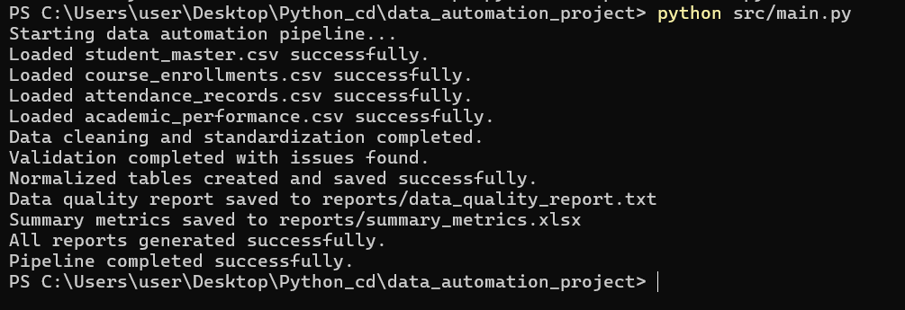

# 📊 Data Cleaning & Validation Automation System

##  Overview

This project is a **Python-based data automation pipeline** designed to transform messy, multi-source datasets into **clean, structured, and analyse ready data** all in a single run.

Instead of manually cleaning data in Excel, this system:

* Cleans inconsistencies
* Validates data quality
* Organizes data into structured tables
* Generates reports automatically

👉 In simple terms: **It turns raw, messy data into reliable data you can actually use.**

---

## 🎯 Key Objectives

* Reduce manual data cleaning effort
* Improve data accuracy and consistency
* Automate repetitive preprocessing tasks
* Generate reporting-ready outputs

---

## ⚙️ Features

### 🔹 Multi-Source Data Ingestion

* Reads multiple datasets from a single directory
* Handles inconsistent schemas across files

### 🔹 Data Cleaning & Standardization

* Standardizes column names and formats
* Removes duplicates
* Handles missing values
* Normalizes categorical data

### 🔹 Automated Data Validation

* Detects missing and invalid values
* Identifies duplicates and inconsistencies
* Validates ranges (e.g., GPA, attendance)
* Ensures referential integrity across tables

### 🔹 Relational Data Structuring

* Organizes data into structured tables:

  * Students
    n  - Courses
  * Enrollments
  * Attendance
* Aligns with basic relational database principles

### 🔹 Automated Reporting

* Generates:

  * 📄 Data quality report (TXT)
  * 📊 Summary metrics (Excel)
* Provides quick insights for decision-making

---

## 🏗️ Project Structure

```
data_automation_project/
│
├── data/
│   ├── raw/                # Input datasets
│   └── processed/          # Auto-generated cleaned data
│
├── reports/                # Auto-generated reports
│
├── src/                    # Source code
│   ├── ingest.py
│   ├── clean.py
│   ├── validate.py
│   ├── normalize.py
│   ├── report.py
│   └── main.py
│
├── requirements.txt
└── README.md
```

---

## 📥 Input Data

Place the following files in `data/raw/`:

* `student_master.csv`
* `course_enrollments.csv`
* `attendance_records.csv`
* `academic_performance.csv`

---

## ▶️ How to Run

1. Install dependencies:

```
pip install -r requirements.txt
```

2. Run the pipeline:

```
python src/main.py
```

---

## 📤 Outputs

### 📁 Processed Data

Generated automatically in:

```
data/processed/
```

Includes:

* Cleaned master dataset
* Structured tables (students, courses, enrollments, attendance)

### 📊 Reports

Generated automatically in:

```
reports/
```

Includes:

* Data quality report
* Summary metrics dashboard (Excel)

---

## 🧠 Example Workflow

1. Load raw datasets
2. Clean and standardize data
3. Validate data quality
4. Organize into structured tables
5. Generate reports

👉 All steps run automatically with a single command.

---

## 💡 Key Highlights

* Fully automated end-to-end pipeline
* Modular and scalable design
* Real-world data engineering workflow
* Focus on data quality and reliability

---

## 🛠️ Tech Stack

* Python
* Pandas
* OpenPyXL

---

## 📌 Use Case

This project simulates real-world data workflows where raw data is often messy and inconsistent. It demonstrates how automation can:

* Improve efficiency
* Reduce human error
* Enable faster and more reliable analysis

---

## 📸 Project Demonstration

### ▶️ Pipeline Execution



This output demonstrates:

* Successful ingestion of multiple datasets
* Automated data cleaning and standardization
* Detection of validation issues
* Generation of structured tables
* Automatic creation of reports

---

## ⭐ Final Note

This project showcases how data cleaning, validation, and structuring can be automated to support **data-driven decision-making** in real-world scenarios.
